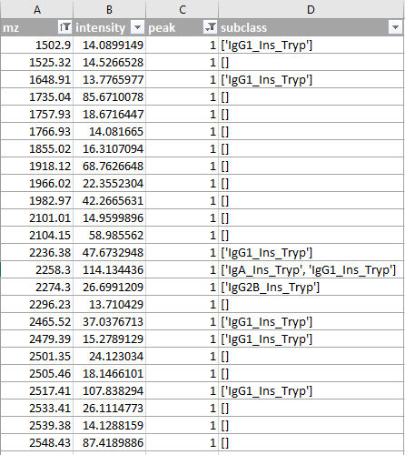

# Identification of Antibody Subclasses

To determine the subclass of an antibody, the mass spectrum is compared with a library of simulated mass spectra of each antibody class. 

### Input
- directory with experimental MS files with mass and intensity columns in .txt format
- directory with theoretical MS files with mass and intensity columns in .txt format

### Output
- overview table showing absolute number of overlapping peaks between all experimental and theoretical MS files in .csv format
- directory with experimental MS files with additional "peak" and "subclass" columns in .csv format

## Generate library files using MS-Digest
1. Find sequence of antibody subclass on [Uniprot](https://www.uniprot.org) or [IMGT](http://www.imgt.org/mAb-DB/)
2. Use [MS-Digest](https://prospector.ucsf.edu/prospector/cgi-bin/msform.cgi?form=msdigest) to create theoretical spectra based on sequence of Fc domain (CH2 & CH3)
3. Collect data in local directory

